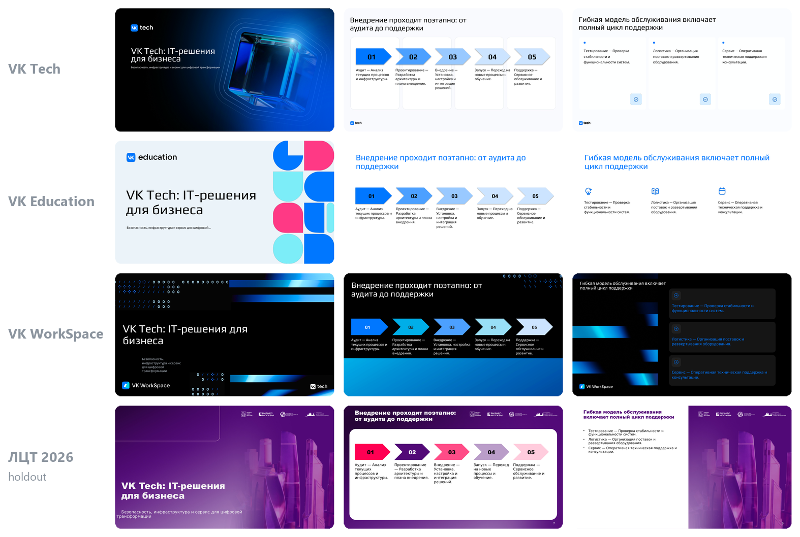
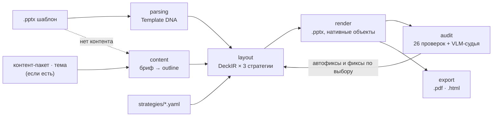
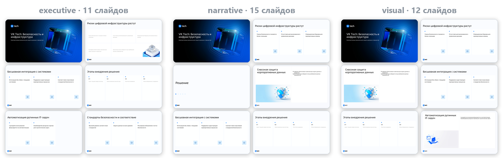
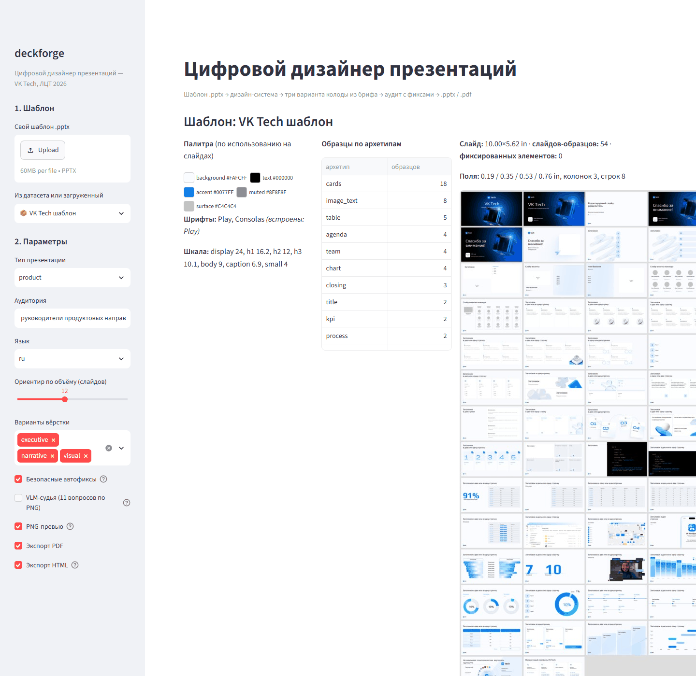
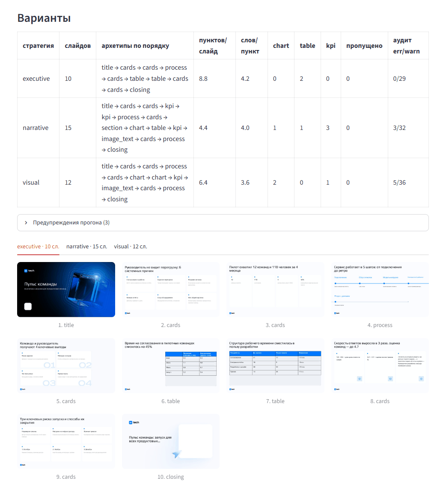
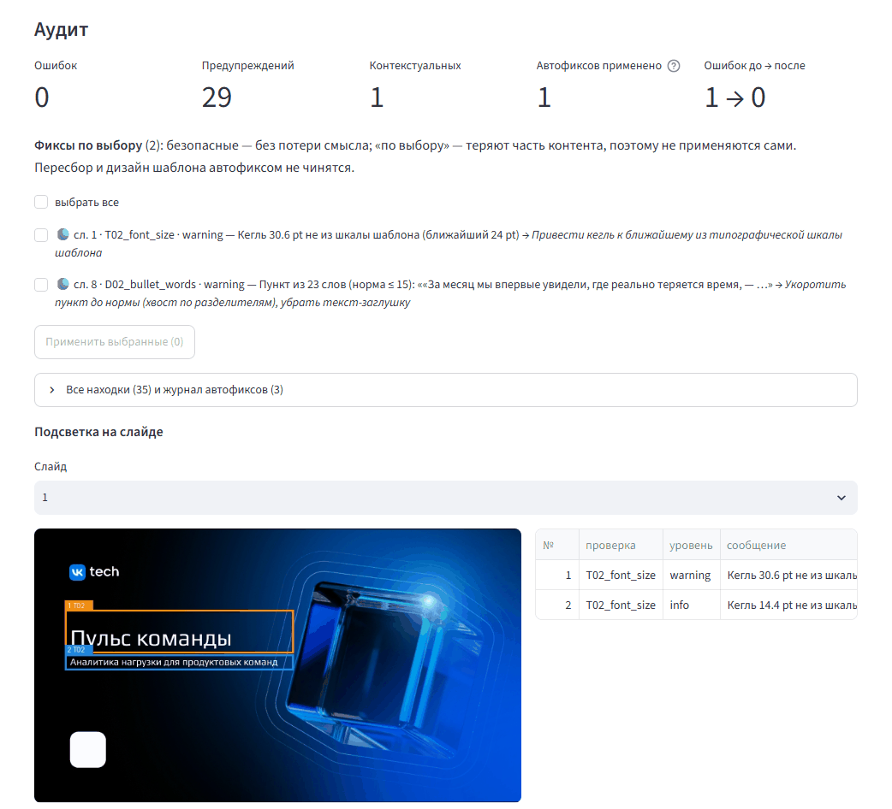

<div align="center">

# DECKFORGE

**Цифровой дизайнер презентаций.** Читает любой .pptx-шаблон как дизайн-систему и собирает по нему новую презентацию из нативных объектов PowerPoint — в трёх вариантах вёрстки, с аудитом и экспортом в .pptx, .pdf и .html.

[](https://deckforge.streamlit.app) [](https://kireev-duty.github.io/deckforge/) [](https://github.com/kireev-duty/deckforge/releases/tag/v0.1.4) [](pyproject.toml) [](LICENSE) [](docs/PLAN.md)

[Демо-стенд](https://deckforge.streamlit.app) · [Галерея колод](https://kireev-duty.github.io/deckforge/) · [Архитектура](docs/ARCHITECTURE.md) · [Аудит](docs/AUDIT.md) · [Модели](docs/MODELS.md) · [Сценарий демо](docs/DEMO.md)

</div>

<p align="center">
  
</p>
<p align="center"><sub>Один контент — четыре шаблона (вариант visual). Шаблон ЛЦТ 2026 не использовался при разработке правил разбора.</sub></p>

## Что умеет

- **Любой шаблон → дизайн-система.** Палитра с ролями, типографическая шкала, сетка и поля, фиксированные элементы и слайды-образцы по архетипам — из фактического использования на слайдах, а не из `theme.xml`. Подходят .pptx, .potx, .ppsx и .pptm; шаблон без слайдов (только мастер и лейауты) размечается по лейаутам. Неоднозначные образцы уточняет VLM — кнопкой в UI или `deckforge prepare`, до генерации и вне её бюджета.
- **Контент — по лестнице.** Репозиторий (README, документация, история git → факты) → контент-пакет (бриф, тексты, данные) → тема одной строкой → **только шаблон**: бриф выводится из самого шаблона. Чисел и фактов без источника сервис не выдумывает.
- **Три варианта вёрстки** на одном контенте — executive, narrative, visual. Они различаются плотностью и способом показа данных; стиль шаблона не трогают.
- **Нативные объекты.** Слайды собираются клонированием образцов шаблона: текст, фигуры, chart, table, picture; шаги процесса — настоящий SmartArt «Простой процесс» (правится в PowerPoint как SmartArt). Растровых слайдов нет.
- **Текст к каждому слайду.** Текст выступления к каждому слайду каждого варианта под заданную длительность (по умолчанию 7 минут): в заметках .pptx, в HTML (клавиша N), в UI и файлом `speech.md`. Аудит проверяет, что текст есть у каждого слайда и укладывается во время.
- **Аудит — часть пайплайна.** 26 детерминированных проверок по XML и VLM-судья (11 вопросов по PNG слайда). Безопасные фиксы применяются сами, остальные пользователь выбирает в UI с подсветкой находки на слайде.
- **Экспорт** в .pptx, .pdf и .html — один самодостаточный файл, где текст остаётся текстом, а диаграммы — SVG.
- **Браузеры.** Веб-интерфейс и HTML-экспорт корректно работают в актуальной и предыдущей версиях Chrome, Firefox, Safari и Яндекс.Браузера на macOS и Windows.
- **Три варианта ≤ 5 минут вместе.** Колоды собираются параллельно под одним дедлайном прогона.
- **Промпты — файлы, а не код.** Скиллы версионируются в `skills/<name>/v<N>/`; `manifest.json` каждой колоды хранит версии скиллов, моделей и стратегии.

## Попробовать

- **[Демо-стенд](https://deckforge.streamlit.app):** выбрать шаблон слева или загрузить свой .pptx → «Только шаблон» → «Сгенерировать варианты». Три колоды за 1–3 минуты, с аудитом и скачиванием .pptx / .pdf / .html.
- **[Галерея](https://kireev-duty.github.io/deckforge/):** 15 готовых колод открываются прямо в браузере: 4 шаблона × 3 стратегии и сценарий жюри (контекст — репозиторий).

> [!NOTE]
> Стенд работает на бесплатном Streamlit Community Cloud и засыпает без посетителей. На заставке нажмите «Yes, get this app back up» — запуск занимает 1–2 минуты. Если ключ LLM стенда исчерпан или API недоступен, работает режим «Готовый outline»: он собирает колоды без LLM.

## Как это работает



| Слой | Что делает |
|---|---|
| `parsing/` | .pptx → `TemplateDNA`: токены из фактического использования, сетка, фиксированные элементы, образцы по архетипам (правила по геометрии + VLM для неоднозначных) |
| `content/` | контент-пакет, тема или сам шаблон → бриф → `DeckOutline` (один вызов LLM на прогон); текст выступления к свёрстанной колоде (вызов на вариант) |
| `layout/` | стратегия → состав слайдов, выбор образца под каждый слайд, подгонка текста под слоты, применение автофиксов |
| `render/` | `DeckIR` → .pptx: клонирование образцов, нативные chart / table / picture, SmartArt для шагов процесса |
| `audit/` | детерминированные проверки по XML + VLM-судья по PNG; предлагает фиксы, но колоду не меняет |
| `export/` | PDF и PNG через LibreOffice, собственный HTML-рендер готовой колоды |
| `pipeline/` | этапы прогона, параллельная сборка вариантов под одним дедлайном, `manifest.json` |
| `ui/`, `api/`, `cli.py` | Streamlit, FastAPI, CLI — точки входа без бизнес-логики |

Зависимости только «вниз», контракты между слоями — `deckforge/core/ir.py`. Подробно — [ARCHITECTURE.md](docs/ARCHITECTURE.md).

## Быстрый старт

Нужны Python ≥ 3.12, Git LFS, LibreOffice (для PDF, PNG и VLM-судьи) и доступ к OpenAI-совместимому inference API. Либо только Docker — [см. ниже](#docker).

> [!TIP]
> **Linux (Ubuntu 24.04): пошаговая инструкция от чистой машины до трёх колод — [docs/INSTALL.md](docs/INSTALL.md).** Там же ожидаемый вывод каждого шага, запуск без ключа API, Docker и неполадки.

```bash
git lfs install                    # один раз на машине, ДО clone: шаблоны лежат в Git LFS
git clone https://github.com/kireev-duty/deckforge.git && cd deckforge
python -m venv .venv
```

<details open>
<summary><b>Windows</b></summary>

```bat
.venv\Scripts\python.exe -m pip install -e .[dev]
copy .env.example .env
:: впишите LLM_API_KEY в .env
.venv\Scripts\python.exe tools\check_env.py
.venv\Scripts\python.exe -m pytest -q
```

</details>

<details>
<summary><b>Linux</b> — подробно в <a href="docs/INSTALL.md">docs/INSTALL.md</a></summary>

```bash
.venv/bin/pip install -e '.[dev]'
cp .env.example .env                 # вписать LLM_API_KEY
.venv/bin/python tools/check_env.py
.venv/bin/python -m pytest -q
```

</details>

`tools/check_env.py` проверяет, что шаблоны скачались, ключи, доступ к моделям и LibreOffice; без ключа — только репозиторий и LibreOffice. Если после clone шаблоны в `data/` весят ~130 байт, это LFS-указатели: поставьте git-lfs и выполните `git lfs pull`.

Разметка образцов шаблонов датасета — ответы VLM `template_tagger`, привязанные к sha1 файла, — лежит в `data/archetypes/`. С ней `examples/output` воспроизводятся без вызова VLM на этапе разбора. Новый шаблон сразу размечается правилами; VLM-уточнение — `deckforge prepare "path/to/template.pptx"` или кнопка «Уточнить разметку VLM» в UI. Ответы модели ложатся в `out/archetypes/`, и следующий разбор их применяет.

## Запуск

```bash
# разбор шаблона: палитра с ролями, шрифты, шкала, сетка, образцы по архетипам
deckforge parse "path/to/template.pptx" [--json dna.json]

# подготовка шаблона (вне бюджета генерации): PNG образцов → правила + VLM → кэш разметки в out/archetypes/
deckforge prepare "path/to/template.potx" [--no-vlm] [--parallel 4]

# три варианта по конфигу: контент → outline (LLM) → колоды по стратегиям → аудит → автофиксы → .pptx / .pdf / .html
deckforge run --config configs/run.example.yaml [--png] [--no-judge] [--no-images] [--outline готовый.json] \
    [--minutes 7] [--no-notes]       # длительность выступления, под неё пишется текст к слайдам

# на входе только шаблон: бриф выводит из него скилл template_brief
deckforge run --config configs/template_only.yaml [--topic "тема одной строкой"]

# другой шаблон с тем же конфигом
deckforge run --config configs/run.example.yaml -t "path/to/template.pptx" -o out/run/my

# контекст — репозиторий, документация и история (подготовка вне бюджета генерации, кэш по содержимому)
deckforge prepare-context path/to/repo -o out/context.json          # папка или .zip
deckforge run --config configs/run.example.yaml --context out/context.json --topic "задача презентации"

# аудит любой колоды по шаблону (колода не меняется; --fix-plan — что чинилось бы)
deckforge audit deck.pptx -t template.pptx [--ir deck.ir.json] [--contextual] [--fix-plan]

# экспорт готовой колоды: .html — без LibreOffice; --pdf / --png — через LibreOffice
deckforge export deck.pptx [--html out.html] [--pdf] [--png] [--ir deck.ir.json]

# веб-интерфейс и HTTP API (Swagger на /docs)
streamlit run deckforge/ui/app.py
uvicorn deckforge.api.app:app --reload
```

`deckforge …` — то же, что `python -m deckforge.cli …`. API: `GET /templates`, `POST /templates` [→ `POST /templates/{id}/prepare`], `POST /generate` (поле `repo` — .zip репозитория как контекст) → `GET /jobs/{id}` → `…/decks/{strategy}/audit` | `fix` | `files/{name}`.

### Результат прогона

```text
out/run/<name>/                      # или out/ui/runs/<время>/ для UI
├── outline.json                     # структура и тексты — один на все стратегии
├── brief.md                         # бриф, если выведен из темы или из шаблона
├── dna.json                         # Template DNA шаблона
├── <strategy>.pptx | .pdf | .html   # колода и экспорт (текст выступления — в заметках .pptx и по клавише N в .html)
├── <strategy>.speech.md             # текст выступления по слайдам с расчётом времени
├── <strategy>.ir.json               # DeckIR после автофиксов
├── <strategy>.audit.json            # находки аудита
├── <strategy>.manifest.json         # провенанс: скиллы, модели, стратегия, план, автофиксы, картинки, речь, тайминги
├── <strategy>/                      # PNG-превью слайдов
├── images/                          # иллюстрации: кэш по sha1 входов, повторный прогон их не оплачивает
├── compare.md                       # сравнение вариантов
└── run.json                         # сводка прогона
```

### Docker

```bash
cp .env.example .env                 # ключи и модели; без ключа работают parse и run --outline --no-judge --no-images
docker compose build                 # python 3.12 + LibreOffice Impress, ≈1,6 ГБ
docker compose up                    # API http://localhost:8000/docs и UI http://localhost:8501
docker compose run --rm cli run -c configs/run.example.yaml --png     # прогон конфигом → ./out/run/vk_tech
docker compose run --rm cli parse "data/templates/VK Tech шаблон.pptx"
```

С хоста монтируются:
- `./data` — шаблоны из Git LFS и разметка их образцов `data/archetypes`;
- `./examples`;
- `./out` — в том числе рабочий кэш разметки `out/archetypes`;
- `./configs`.

Шрифтов Play и Montserrat в образе нет, LibreOffice подставляет DejaVu или Liberation. Поэтому PDF и PNG из контейнера чуть отличаются от локальных, а .pptx и .html — нет.

## Переменные окружения

Рабочая конфигурация — [.env.example](.env.example): `cp .env.example .env` и вписать `LLM_API_KEY`. Файл `.env` с ключом в репозиторий не попадает.

| Переменная | По умолчанию | Назначение |
|---|---|---|
| `LLM_BASE_URL` | `https://openrouter.ai/api/v1` | OpenAI-совместимый endpoint; для инференса VK меняются только он и ключ |
| `LLM_API_KEY` | — | ключ API. Без него работают `parse`, `run --outline --no-judge --no-images` и режим UI «Готовый outline» |
| `LLM_MODEL` | `qwen/qwen3.8-27b-20260814` | текст: бриф из шаблона, outline, промпты картинок |
| `VLM_MODEL` | `qwen/qwen3.8-27b-20260814` | зрение: разметка образцов шаблона, VLM-судья |
| `T2I_MODEL` | `black-forest-labs/flux.2-klein-4b` | иллюстрации; пустое значение отключает картинки |
| `T2I_BASE_URL`, `T2I_API_KEY` | как у LLM | другой провайдер для картинок — задать оба |
| `SOFFICE_PATH` | автопоиск | путь к LibreOffice (PDF, PNG, VLM-судья) |
| `RUN_TIME_BUDGET_S` | `300` | бюджет на весь прогон — три варианта вместе, от старта; прежнее имя `DECK_TIME_BUDGET_S` тоже читается |
| `RUN_MAX_PARALLEL_DECKS` | `3` | сколько колод собирать параллельно; `1` — по очереди |
| `DECK_MAX_PARALLEL_LLM` | `4` | параллельных вызовов модели внутри колоды (судья по слайдам, картинки) |
| `LLM_MAX_CONCURRENCY` | `0` | общий лимит одновременных запросов на все колоды; `0` — без лимита (для инференса с ограничением RPS) |
| `LLM_NO_THINK_JSON` | выключение reasoning для OpenRouter и vLLM | JSON с параметрами, которые выключают «размышления» Qwen3.x в каждом вызове |
| `DECKFORGE_PUBLIC` | — | `1` — режим публичного стенда: генерации всех посетителей по одной, судья по умолчанию выключен |
| `DECKFORGE_LFS_BASE` | — | откуда докачать шаблоны датасета, если хостинг клонировал репозиторий без Git LFS |
| `DECKFORGE_FONTS_DIR` | — | дополнительная папка с TTF для метрик текста в аудите |

## Инференс и модели

Все колоды в `examples/output/` сгенерированы **через OpenRouter** (OpenAI-совместимый API) этими моделями и с этими параметрами. С `.env.example` и своим ключом прогон воспроизводится.

| Роль | Модель | Веса, лицензия | Параметры вызова (temperature / max_tokens) |
|---|---|---|---|
| **текст** (`LLM_MODEL`): факты из репозитория, бриф из шаблона, outline, текст выступления, промпты картинок | Qwen3.8-27B<br>`qwen/qwen3.8-27b-20260814` | 27B dense, Apache 2.0 | `context_digest` 0.2 / 3000 · `template_brief` 0.5 / 2000 · `outline_writer` 0.4 / 6000 · `speaker_notes` 0.5 / 6000 · `image_prompter` 0.6 / 400; `response_format=json_object` |
| **зрение** (`VLM_MODEL`): разметка образцов, VLM-судья | та же модель | — | `template_tagger` 0.1 / 1500 · `audit_judge` 0.0 / 1200; PNG слайда как `image_url` |
| **text-to-image** (`T2I_MODEL`): иллюстрации | FLUX.2 [klein] 4B<br>`black-forest-labs/flux.2-klein-4b` | 4B, Apache 2.0 | 1024×576, ≤ 4 картинки на колоду, кэш по sha1 промпта |

Где задано:
- параметры вызовов — `skills/<name>/v<N>/skill.yaml`, действующая версия — `current` в `skills/registry.yaml`;
- клиент — `deckforge/llm/client.py`;
- картинки — `deckforge/content/images.py`.

- **Бюджет времени.** Три колоды собираются параллельно под одним дедлайном `RUN_TIME_BUDGET_S`. Когда до него остаётся мало, сначала пропускаются иллюстрации, затем VLM-судья; вёрстка, детерминированный аудит, автофиксы и экспорт выполняются всегда.
- **Замер.** VK Tech с судьёй и картинками: три колоды готовы за 200 с от старта. На готовом outline — 91 с против 213 с при сборке по очереди. Подробно — [ARCHITECTURE, «Бюджет времени на прогон»](docs/ARCHITECTURE.md#бюджет-времени-на-прогон-три-варианта--5-мин).
- **Вызовы.** Таймаут 120 с, 2 ретрая. «Размышления» Qwen3.x выключены в каждом вызове: иначе они съедают `max_tokens` и втрое замедляют ответ.
- **Переход на инференс VK** — меняются только `LLM_BASE_URL` и `LLM_API_KEY`, модель та же.

Провенанс каждой колоды — её `manifest.json`: модели, версии скиллов, стратегия, журнал вызовов LLM с длительностью и токенами. Лицензии, ссылки на Hugging Face и системные требования — [MODELS.md](docs/MODELS.md).

## Три стратегии

Стратегия не меняет стиль шаблона. Она задаёт, **сколько** сказать на слайде и **в какой форме** показать данные — `strategies/{executive,narrative,visual}.yaml`.

| | executive | narrative | visual |
|---|---|---|---|
| для кого | руководителю на 5 минут, читается без докладчика | доклад со сцены, обучение, онбординг | публичная защита, конференция |
| объём (при ориентире 12) | 10–11 слайдов | 12–15 | 10–12 |
| числовой ряд | таблица | диаграмма | диаграмма |
| ключевые метрики | KPI или карточки | KPI, по слайду | KPI |
| шаги процесса | образец шаблона или нумерованный список | образец шаблона, без него — SmartArt | SmartArt «Простой процесс» |
| разделители разделов | нет | да | нет |

<p align="center">
  
</p>

Почему ось различий именно такая и как стратегия применяется в пайплайне — [ARCHITECTURE, «Три стратегии»](docs/ARCHITECTURE.md#три-стратегии-ось-различий).

## Интерфейс

Один экран, пять шагов:
1. шаблон — из датасета или свой .pptx / .potx; у своего — кнопка «Уточнить разметку VLM» (30–60 с, до генерации);
2. контент — только шаблон, тема одной строкой, бриф с файлами (.md, .txt, .docx, .pdf, .json, .csv, .xlsx) или репозиторий (.zip или папка: README, docs, история git);
3. три варианта с превью;
4. аудит с выбором фиксов и подсветкой находок на слайде;
5. скачивание .pptx / .pdf / .html / json.

**Шаблон разобран:** палитра по фактическому использованию, шрифты, шкала, образцы по архетипам, слайды шаблона.



**Варианты** (режим «Только шаблон»):
- сравнение стратегий и для кого каждая;
- бриф, выведенный из шаблона;
- PNG-превью колоды.

Три колоды собраны параллельно за 62 с.



**Аудит** (контент «Пульс команды», VLM-судья включён):
- ошибка исправлена автофиксом (1 → 0);
- две находки судьи;
- фиксы по выбору;
- подсветка находок на слайде.



HTML-экспорт — собственный рендер по XML готовой колоды (`deckforge/export/html.py`), а не растр:
- текст остаётся текстом, диаграммы — SVG, таблицы — `<table>`, картинки вшиты;
- фон и декор мастера и лейаута на месте;
- открывается с `file://`: ←/→ — листать, F — режим показа, печать — слайд на страницу.

## Примеры

Контент-пакет датасета — это только три шаблона, поэтому примеры собраны в режиме «только шаблон». Бриф выведен из шаблона VK Tech ([brief.md](examples/output/vk_tech/brief.md)), его [outline](examples/output/vk_tech/outline.json) прогнан на всех четырёх шаблонах (`configs/final/*.yaml`). Детерминированных ошибок аудита нет ни в одной из 12 колод.

| Шаблон | executive | narrative | visual | Сравнение |
|---|---|---|---|---|
| VK Tech | [.pptx](examples/output/vk_tech/executive.pptx) · [.html](https://kireev-duty.github.io/deckforge/vk_tech/executive.html) · 11 сл. | [.pptx](examples/output/vk_tech/narrative.pptx) · [.html](https://kireev-duty.github.io/deckforge/vk_tech/narrative.html) · 15 сл. | [.pptx](examples/output/vk_tech/visual.pptx) · [.html](https://kireev-duty.github.io/deckforge/vk_tech/visual.html) · 12 сл. | [compare.md](examples/output/vk_tech/compare.md) |
| VK Education | [.pptx](examples/output/vk_education/executive.pptx) · [.html](https://kireev-duty.github.io/deckforge/vk_education/executive.html) · 11 сл. | [.pptx](examples/output/vk_education/narrative.pptx) · [.html](https://kireev-duty.github.io/deckforge/vk_education/narrative.html) · 15 сл. | [.pptx](examples/output/vk_education/visual.pptx) · [.html](https://kireev-duty.github.io/deckforge/vk_education/visual.html) · 12 сл. | [compare.md](examples/output/vk_education/compare.md) |
| VK WorkSpace | [.pptx](examples/output/vk_workspace/executive.pptx) · [.html](https://kireev-duty.github.io/deckforge/vk_workspace/executive.html) · 11 сл. | [.pptx](examples/output/vk_workspace/narrative.pptx) · [.html](https://kireev-duty.github.io/deckforge/vk_workspace/narrative.html) · 12 сл. | [.pptx](examples/output/vk_workspace/visual.pptx) · [.html](https://kireev-duty.github.io/deckforge/vk_workspace/visual.html) · 12 сл. | [compare.md](examples/output/vk_workspace/compare.md) |
| ЛЦТ 2026 (holdout) | [.pptx](examples/output/lct2026_holdout/executive.pptx) · [.html](https://kireev-duty.github.io/deckforge/lct2026_holdout/executive.html) · 11 сл. | [.pptx](examples/output/lct2026_holdout/narrative.pptx) · [.html](https://kireev-duty.github.io/deckforge/lct2026_holdout/narrative.html) · 12 сл. | [.pptx](examples/output/lct2026_holdout/visual.pptx) · [.html](https://kireev-duty.github.io/deckforge/lct2026_holdout/visual.html) · 12 сл. | [compare.md](examples/output/lct2026_holdout/compare.md) |

Рядом с каждой колодой лежат её .pdf, `manifest.json`, `ir.json`, `audit.json` и текст выступления `speech.md`.

**Сценарий жюри** — контекст из репозитория. `prepare-context .` на самом deckforge (README, docs, история git → 71 факт), задача «питч на 7 минут: проблема, подход, архитектура, демо, аудит, выводы», шаблон VK Tech (`configs/final/jury_scenario.yaml`). В фактах есть цифры, поэтому здесь видна и ось визуализации данных: у executive — таблицы, у narrative и visual — диаграмма и KPI.

| Сценарий | executive | narrative | visual | Сравнение |
|---|---|---|---|---|
| Контекст — репозиторий deckforge | [.pptx](examples/output/jury_scenario/executive.pptx) · [.html](https://kireev-duty.github.io/deckforge/jury_scenario/executive.html) · 11 сл. | [.pptx](examples/output/jury_scenario/narrative.pptx) · [.html](https://kireev-duty.github.io/deckforge/jury_scenario/narrative.html) · 15 сл. | [.pptx](examples/output/jury_scenario/visual.pptx) · [.html](https://kireev-duty.github.io/deckforge/jury_scenario/visual.html) · 12 сл. | [compare.md](examples/output/jury_scenario/compare.md) |

Ось визуализации данных (таблица ↔ диаграмма ↔ KPI) лучше видна на синтетическом пакете «Пульс команды» (`examples/content_pack`), где есть ряды, таблица и метрики. Он воспроизводится без LLM: `tools/build_variants.py "data/templates/VK Tech шаблон.pptx"`.

## Структура репозитория

```text
deckforge/          пакет; слои зависят только «вниз»
├── core/           контракты между слоями (ir.py), чтение OOXML, каталог автофиксов
├── llm/            клиент OpenAI-совместимого API, загрузка скиллов
├── parsing/        .pptx → Template DNA
├── content/        бриф из шаблона, контент-пакет, outline, иллюстрации
├── layout/         стратегия → план слайдов, выбор образца, подгонка текста, автофиксы
├── render/         DeckIR → .pptx клонированием образцов
├── audit/          детерминированные проверки и VLM-судья
├── export/         LibreOffice (PDF, PNG), HTML-рендер
├── pipeline/       этапы прогона, бюджет времени, реестр шаблонов
└── ui/ api/ cli.py Streamlit, FastAPI, CLI
skills/             промпты, JSON-схемы и параметры моделей: <скилл>/v<N>/ + registry.yaml
strategies/         executive / narrative / visual
configs/            конфиги прогона: run.example.yaml, template_only.yaml, final/*.yaml
data/               шаблоны датасета, holdout, data/wild и разметка образцов (Git LFS)
examples/           15 готовых колод (output/: 4 шаблона × 3 стратегии + сценарий жюри) и синтетический контент-пакет
docs/               документация и питч-дек
tools/              служебные скрипты: разбор шаблона, рендер, стресс-тест, браузеры, галерея
tests/              pytest: разбор шаблонов, каждая проверка аудита на своей фикстуре, e2e на кассетах LLM
```

## Документация

| Документ | О чём |
|---|---|
| [ARCHITECTURE.md](docs/ARCHITECTURE.md) | пайплайн, границы слоёв, режимы входа, ключевые решения, три стратегии, бюджет времени |
| [AUDIT.md](docs/AUDIT.md) | все проверки: детерминированные и контекстуальные, покрытие тестами, автофиксы |
| [MODELS.md](docs/MODELS.md) | модели, лицензии, ссылки на Hugging Face, системные требования |
| [INSTALL.md](docs/INSTALL.md) | установка и запуск на Linux шаг за шагом: пакеты, клон, ключ, проверка, прогон конфигом, Docker, неполадки |
| [DEMO.md](docs/DEMO.md) | сценарий живого прогона и видео-демо (≤ 7 минут) на незнакомом шаблоне |
| [DEVELOPMENT.md](docs/DEVELOPMENT.md) | окружение, служебные скрипты, демо-стенд, правила для кода |
| [PLAN.md](docs/PLAN.md) · [BACKLOG.md](docs/BACKLOG.md) | план разработки и чек-лист сдачи · известные дефекты и что дальше |

Презентация для защиты — [docs/deckforge_pitch.pptx](docs/deckforge_pitch.pptx).

## Ограничения

- **Модели:** только открытые веса (Apache 2.0 / MIT) до 35B; text-to-image — до 20B.
- **Объём:** 10–15 слайдов или заданный пользователем (`target_slides` сдвигает диапазоны стратегий). Если контента мало, стратегия может дать меньше.
- **Демо-стенд** (бесплатный Streamlit Community Cloud):
  - генерации всех посетителей идут по одной;
  - VLM-судья по умолчанию выключен, иллюстрации выключены;
  - шрифтов Play и Montserrat на стенде нет, поэтому PNG-превью и PDF рисуются с подменой; .pptx и .html от этого не зависят.

  Устройство стенда — [DEVELOPMENT, «Демо-стенд»](docs/DEVELOPMENT.md#демо-стенд).
- **UI:** прогон выполняется in-process. Новый прогон, запущенный поверх идущего, обрывает предыдущий. Параллельные задания — через API (`POST /generate`).
- **Схемы SmartArt:** только процесс из 2–6 шагов — макет «Простой процесс» в цветах и шрифте шаблона; cycle, pyramid и иерархий пока нет. SmartArt из самого шаблона переносится целиком; в HTML его фигуры рисуются, кроме произвольных контуров, секторов и дуговых стрелок.
- **Пиктограммы** берутся только из образцов самого шаблона: на шаблоне без иконок их не будет.
- **Шаблон без слайдов** (обычный .potx) размечается по лейаутам: на каждый лейаут с плейсхолдерами — слайд-образец. Кегли и геометрия берутся из плейсхолдеров лейаута, поэтому колода получается проще, чем по шаблону со слайдами-примерами. Лейауты без плейсхолдеров образцов не дают.
- **Проверка в PowerPoint:** в .pptx только нативные объекты. Открытие, сохранение и редактируемость проверены в PowerPoint (Microsoft 365, `tools/powerpoint_check.py`).

## Лицензия

Код — [MIT](LICENSE). Шаблоны презентаций в `data/` и материалы ТЗ в `docs/tz/` принадлежат их правообладателям (VK, организаторы ЛЦТ и авторы шаблонов из `data/wild`) и под лицензию MIT не подпадают.

Команда Ashen One — кейс VK Tech «Цифровой дизайнер презентаций», хакатон «Лидеры цифровой трансформации 2026».
