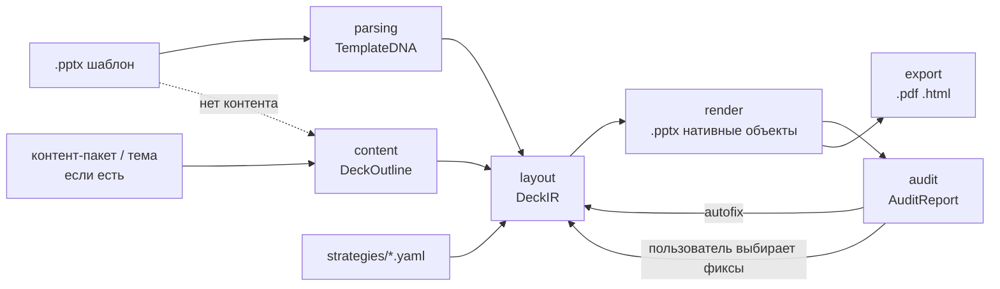

# ARCHITECTURE

## Идея в одном абзаце

Шаблон .pptx читается как **набор правил** (Template DNA): палитра с ролями, типографическая шкала, сетка, фиксированные элементы и **слайды-образцы** с размеченными слотами. Новая презентация собирается **клонированием образцов** и заполнением их слотов контентом, который LLM подготовила заранее (структура → тексты → подгонка под лимиты слотов). Контента на входе может не быть вовсе: тогда бриф выводится из самого шаблона (раздел «Режимы входа»). Аудит встроен в пайплайн: детерминированные проверки по XML + контекстуальные по PNG, с авто-фиксами и выбором пользователя. Экспорт — нативные объекты .pptx, PDF через LibreOffice, HTML — собственный рендер по XML готовой колоды.

## Пайплайн

## Слои и контракты

| Слой | Вход → Выход | Что знает | Чего не делает |
|---|---|---|---|
| `parsing/` | .pptx → `TemplateDNA` | OOXML (`core/package.py` — пакет, тема, цепочки наследования; общий с `audit/`), LibreOffice-рендер, VLM (`template_tagger`); `dna.build_dna` = токены + сетка/поля (перцентили кромок контентных фигур) + фиксированные элементы + образцы | не знает о брифе и генерации |
| `content/` | контент (пакет / тема / шаблон) → `DeckOutline`; `DeckOutline` + стратегия → `DeckOutline` с картинками | `content_pack` (папка → фрагменты с id: секции брифа, текст `*.md|txt|docx|pdf`, данные `data/*.json|csv|xlsx`; формат ТЗ не задаёт, нечитаемый файл — предупреждение), `template_brief` (`template_digest` — слепок шаблона: бренд, палитра, шрифты, архетипы, теги VLM и тексты слайдов-образцов без заглушек; `write_template_brief` — один вызов LLM → `TemplateBrief` → markdown-бриф; `pack_from_brief` — пакет из одного фрагмента `brief`), `outline_writer` (один вызов LLM на прогон + `repair_outline`: мягкое приведение ответа к контракту — перенумерация, недоступный архетип → bullets, серии/таблицы/KPI разной формы, обязательные title/closing; текстовый слайд без тела берёт текст из `subtitle`, а если и его нет — снимается, чтобы в колоде не осталось слайда с одним заголовком), `images` (`illustrate`: какие слайды иллюстрировать — по `Strategy.images` и `RunConfig.images`; промпт — скилл `image_prompter` по заголовку, тексту и палитре; генерация — `LLMClient.generate_image`; до 4 картинок на колоду параллельно, кэш по sha1 входов в `<out>/images/` — общий для колод прогона: одинаковую картинку генерирует одна колода, соседняя ждёт её по ключу) | не знает координат и шрифтов; стратегию видит только как режим картинок |
| `layout/` | `DeckOutline` + `TemplateDNA` + стратегия → `DeckIR`; `DeckIR` + находки аудита → исправленный `DeckIR` | `planner` (применение стратегии к составу слайдов), `exemplar_picker` (образец под слайд с фолбэками по архетипам), `fitting` (детерминированная подгонка текста под слоты), `autofix` (применение фиксов из каталога `core/autofix` к копии IR, журнал applied/skipped), `builder` (сборка IR слайд за слайдом). Слайд, на котором не осталось бы ничего кроме заголовка, `planner` снимает — готовый outline (`--outline`) идёт мимо `repair_outline` | не пишет файлы, не вызывает LLM |
| `render/` | `DeckIR` → .pptx | клонирование образцов, python-pptx charts/tables, иконки, картинки | не вызывает LLM |
| `audit/` | .pptx + `TemplateDNA` (+ `DeckIR`, + PNG) → `AuditReport` | `context` (колода читается один раз через `core/deck_reader` — общий с `export/` читатель: фигуры с резолвленными шрифтами/цветами, картинки, данные chart/table; с DeckIR известно, что заполнено нами, что декор образца), 24 детерминированные проверки `deterministic/` (см. `docs/AUDIT.md`), `text_metrics` (Pillow); `contextual/judge` — VLM-судья (`audit_judge`, 11 вопросов по PNG, параллельно по слайдам) | не изменяет колоду (имена фиксов — из `core/autofix.FIXES`, применяет `layout/autofix`) |
| `export/` | .pptx → .pdf / PNG / .html | LibreOffice headless (`render.py`: pptx → pdf → PNG + contact sheet — один путь для VLM-разметки, аудита, превью и PDF); `html.py` — свой рендер готовой колоды в один самодостаточный файл: фон → фигуры мастера → лейаута → слайда (через `core/deck_reader`), текст с резолвленными шрифтами/кеглями/цветами, диаграммы — inline SVG по данным из XML, таблицы — `<table>`, картинки вшиты, встроенные шрифты — `@font-face` по `p:embeddedFontLst` (EOT датасета сжат MTX → OFL-гарнитуры с Google Fonts, офлайн — fallback-стек), `normAutofit` — shrink-to-fit скриптом. Возможности просмотра — README | не вызывает LLM; HTML не из DeckIR — в IR нет декора образца и мастера |
| `pipeline/` | `RunConfig` (yaml) → outline → колоды по стратегиям | этапы как функции: `parse_template` (шаблон → `ParsedTemplate` + `dna.json`), `content_for_outline` (лестница входа: пакет → тема → шаблон), `make_outline` (один вызов LLM или готовый outline), `build_deck` (стратегия: images → layout → render → аудит → safe-автофиксы → re-render → PNG → VLM-судья → PDF → `manifest.json`), `refine_deck` (фиксы по выбору пользователя к готовой колоде), `run` = всё вместе + `compare.md`, `run.json`: колоды стратегий собираются параллельно в потоках под одним дедлайном прогона (`RunContext.deadline`, раздел «Бюджет времени»); `workspace` — реестр шаблонов (датасет + загрузки) и сборка контент-пакета из файлов пользователя | — |
| `api/`, `ui/`, `cli.py` | точки входа | `cli`: `parse` / `run --config` / `audit` / `export` (html/pdf/png для любой колоды); `ui/app.py` (Streamlit) вызывает `pipeline` in-process: шаблон (датасет или загрузка) → бриф + файлы → варианты с PNG → аудит с чекбоксами фиксов (safe / по выбору; replan и дизайн шаблона не чинятся) и подсветкой `Finding.box` на слайде → скачивание .pptx / .pdf / json; `api/app.py` (FastAPI) — те же функции job'ами: `POST /templates`, `POST /generate` → `GET /jobs/{id}` → `.../decks/{strategy}/audit` → `POST .../fix` → `GET .../files/{name}` (белый список имён), `POST /audit` чужой колоды | не содержат бизнес-логики, друг друга не импортируют |

`manifest.json` каждой колоды (провенанс):

- шаблон (id, путь, sha1), `content_source` (`pack` / `topic` / `template` / `outline`), контент-пакет и/или `brief.md`, путь к outline, стратегия и её версия;
- версии скиллов (`outline_writer: v1`, `audit_judge: v1`), модели (text / vision / image, base_url), журнал вызовов LLM (длительность, токены — бриф и outline прогона + вызовы только этой колоды: промпты картинок, генерации, судья по слайдам);
- план (архетип и заголовок каждого слайда после стратегии), выбранные образцы со скором, предупреждения outline и layout, статистика плотности;
- `audit`: ошибки/предупреждения/контекстуальные, по проверкам, слайды с проблемами, путь к `<strategy>.audit.json`; `autofix`: применено/пропущено, `before`/`after`, журнал правок «было → стало» или причина пропуска; после `refine_deck` — `autofix.user_applied` и `contextual_stale: true`, если находки судьи относятся к колоде до фиксов;
- `images`: режим, сколько сгенерировано / из кэша / из контент-пакета / с ошибкой, по слайдам — промпт и путь;
- `exports` (`pptx`, `pdf`, `html`) и `timings_s` (`parse`, `outline`, `images`, `layout`, `render`, `audit`, `autofix`, `png`, `audit_contextual`, `export_pdf`, `export_html`, `refine`, `deck_build` — работа колоды, `deck_total` — от старта прогона до готовности колоды) и `time_budget_s` — бюджет прогона.

Рядом: `<strategy>.ir.json` — IR уже после фиксов, `dna.json` — полная `TemplateDNA` прогона, `run.json` + `compare.md` — сводка прогона. Пути в `manifest.json` и `run.json` — относительные (файлы колоды — от папки прогона, шаблон и контент-пакет — от корня репо, `rel_path` в `pipeline/run.py`), чтобы примеры в репо не несли путей машины сборки; кэш картинок `images/<key>.json` хранит имя файла рядом.

Контракты (`deckforge/core/ir.py`): `TemplateDNA`, `DeckOutline`, `DeckIR`, `AuditReport` — pydantic v2, сериализуются в JSON и лежат рядом с выходной колодой для воспроизводимости.

## Режимы входа

ТЗ требует собирать презентацию «по краткому брифу и назначению», а контент-пакет описан как исходные
материалы — но на защите его может не быть вовсе: дают незнакомый шаблон и всё. Поэтому вход — лестница,
а не одно обязательное поле (`pipeline/run.content_for_outline`); ступень записывается в `manifest.json`
и `run.json` как `content_source`, а выведенный бриф кладётся рядом с `outline.json` (`brief.md`).

| Что на входе | Откуда контент | `content_source` | Вызовов LLM до outline |
|---|---|---|---|
| бриф и/или файлы (`RunConfig.content_pack`) | `load_content_pack` → фрагменты с id | `pack` | 0 |
| тема одной строкой (`--topic`, `RunConfig.topic`) | тема становится брифом (`pack_from_brief`) | `topic` | 0 |
| **только .pptx** | `template_brief`: слепок шаблона → тема, аудитория, тезисы → бриф | `template` | 1 |
| готовый `outline.json` (`--outline`) | контент не собирается вовсе | `outline` | 0 |

Спуск по лестнице автоматический и мягкий: пустая или отсутствующая папка пакета — не ошибка, а
предупреждение и переход к следующей ступени (раньше это был `RuntimeError` до вызова LLM).

Что даёт сам шаблон: бренд и предметная лексика живут в `Slot.sample_text` (текст слайдов-образцов
сохраняется при классификации и доезжает до `TemplateDNA`), стиль — в палитре, шрифтах и тегах VLM,
состав — в архетипах образцов. `template_digest` собирает это в детерминированный текст (заглушки
вроде «Образец текста» и глифы иконочных шрифтов отброшены через `core/placeholders`), а модель
превращает его в бриф. Проверяемые факты при этом не выдумываются: правило 2 промпта запрещает числа,
даты, имена и цитаты, которых нет в слепке, а `outline_writer` (с v2) не строит `chart`/`table`/`kpi`/`quote`
без данных — колода получается о продукте шаблона, но без фальшивой фактуры. Поэтому же C04 у судьи
с v2 проверяет самосогласованность, а не совпадение с исходниками, которых может не быть (`docs/AUDIT.md`).

## Ключевые решения и почему

1. **Токены из фактического использования, не из темы.** В датасете `theme.xml` у одного шаблона содержит дефолтные Office-цвета и Arial, тогда как слайды используют `#0077FF` и встроенный шрифт Play. Экстрактор строит гистограммы по слайдам/лейаутам/мастеру, резолвит `schemeClr` через тему, тема — только fallback.
2. **Клонирование образцов, а не генерация по лейаутам.** У VK WorkSpace все 15 лейаутов содержат единственный плейсхолдер `title`; весь дизайн живёт в свободных фигурах слайдов. Единственный способ воспроизвести стиль — копировать XML слайда-образца (с rels и медиа) и подменять содержимое слотов. Побочный эффект: экспорт .pptx нативными объектами получается автоматически.
   Механика (`render/pptx_writer.py`): выходной файл — сам шаблон, открытый python-pptx; исходные слайды отвязываются от `p:sldIdLst` перед сохранением (мастера, лейауты, тема и встроенные шрифты остаются), для каждого слайда колоды копируется `p:cSld` + `p:clrMapOvr` образца, связи переносятся с переписыванием rId (картинки — общие части, chart/diagram/xlsx — глубокая копия, т.к. один образец может клонироваться несколько раз). Текст заполняется новыми абзацами с `pPr`/`rPr` образца по уровню, картинки — подменой `blip` с center-crop, chart/table — нативными объектами python-pptx на месте фигур образца. Незаполненное убирается, а не остаётся заглушкой: текстовые слоты очищаются, слот с собственной рамкой и «контейнер» (фон карточки/строки без единого заполненного слота) удаляются вместе со своим декором, заглушки вроде «Вставить фото» чистятся даже у фиксированных фигур и у полей-колонтитулов, которые иначе сохраняются как есть (`core/placeholders`; там же обращения шаблона к автору — «P.S. Не забудьте удалить этот слайд», как на слайдах-инструкциях `data/wild`). Ничего не растеризуется.
   Особенность LibreOffice (им делаются PDF, PNG и, значит, картинки для судьи): плейсхолдеры *лейаута* без пары на слайде он рисует — с текстом-подсказкой «Образец текста» и заливкой карточек; PowerPoint их не показывает. Писатель переносит наследуемые xfrm/заливку/обводку в плейсхолдеры слайда и гасит контентные плейсхолдеры лейаутов (поля — номер, дата — не трогает): вид в PowerPoint не меняется, PDF/PNG чистые. Плейсхолдер картинки (`p:sp` с `ph type="pic"`, как в ЛЦТ2026) при заполнении становится `p:pic` — так делает сам PowerPoint; `blipFill` на `p:sp` LibreOffice не рисует, а аудит считает такой плейсхолдер пустым.
3. **Архетипы по геометрии.** Имена лейаутов ненадёжны (`14_Контент`, `DEFAULT`, дубликаты). Классификация: детерминированные правила по плейсхолдерам/bbox/типам фигур, VLM уточняет неоднозначные случаи и размечает декор. Ответы VLM кэшируются (рабочий `out/archetypes/<stem>.json`; для датасета и holdout — `data/archetypes/<stem>.json` в репо, чтобы чистый clone воспроизводил примеры; привязка к sha1 файла) и при загрузке накладываются на свежий профиль правил — слоты не хранятся, поэтому правки правил (вместимость заголовка по плашке под ним, тела карточки — по высоте подложки, chart-слот на крошечной цифре в центре нарисованного кольца растягивается на декор) действуют сразу.
4. **Стратегии как файлы.** Три варианта вёрстки (`executive`, `narrative`, `visual`) отличаются плотностью, приоритетом архетипов и способом визуализации данных. Ось различий — *плотность + визуализация*, потому что именно она видна с первого взгляда и одинаково применима к любому шаблону. Подробно — в разделе «Три стратегии: ось различий».
5. **Скиллы версионируются как данные.** `skills/<name>/v<N>/` + `registry.yaml`; в `manifest.json` каждой колоды — версии скиллов, моделей и стратегии. Промптов в коде нет.
6. **Аудит с авто-фиксом внутри цикла.** Детерминированные проверки дешёвые (< 1 с на колоду, измерено) — выполняются после каждого рендера; контекстуальные (VLM) — один раз в конце, параллельно по слайдам и по колодам (15 слайдов ≈ 30–70 с, три колоды судятся одновременно, измерено), чтобы три варианта уложились в 5 минут. Аудит различает «мы сломали» и «так устроен шаблон»: геометрия и цвета, унаследованные от образца, дают `warning` с `evidence.in_exemplar`, наши — `error`; проверки шаблонности смотрят только на заполненные нами слоты и добавленные объекты. Без `DeckIR` аудит работает на любой чужой колоде.
   Фиксы делятся на три класса (`core/autofix.FIXES`): *safe* применяются в `run` автоматически с повторным рендером и аудитом, *ir* (теряют контент) — только по выбору пользователя, *replan* остаются предложением; дизайн шаблона (`in_exemplar`) не чинится никогда. Аудит колоду не меняет — фиксы применяет `layout/`, поэтому CLI-`audit` на чужой колоде только показывает, что *чинилось бы* (`--fix-plan`). Подробно — `docs/AUDIT.md`, раздел «Автофиксы».

## Три стратегии: ось различий

**Почему плотность и визуализация, а не цвет, шрифт или сетка.** Стиль задаёт шаблон, и ТЗ требует его соблюдать — значит, варианты не могут различаться палитрой, гарнитурой или композицией слайдов: всё это берётся из образцов. Остаётся то, чем реально различаются презентации одного автора для разных случаев: *сколько* сказать на слайде и *в какой форме* показать числа. Эта ось (а) видна на контактном листе без чтения текста, (б) переносится на любой шаблон, потому что оперирует архетипами, а не координатами, и (в) полностью описывается пятью параметрами в YAML — версионируемыми и проверяемыми.

Стратегия — `strategies/<name>.yaml`, схема `core/strategy.py` (`Strategy`, pydantic). Параметры (executive@v1, narrative@v2 и visual@v2 — в v2 добавлен `process_form`):

| | executive | narrative | visual |
|---|---|---|---|
| для кого | руководителю на 5 минут: статус, отчёт, решение по цифрам; читается без докладчика | доклад со сцены, обучение, онбординг: слайд поддерживает рассказ | публичная защита, конференция, маркетинг: цифры и процессы видны с задних рядов |
| целевой объём (при объёме 12) | 10–11 | 12–15 | 10–12 |
| буллетов / слов в буллете | 6 / 12 | 4 / 10 | 6 / 8 |
| макс. заполнение слайда | 0,75 | 0,55 | 0,70 |
| числовой ряд → | **таблица** | диаграмма | диаграмма |
| сравнение (таблица) → | таблица | две колонки | **диаграмма** |
| ключевые метрики → | KPI (или карточки, если не влезают) | **KPI, по слайду** | KPI |
| шаги процесса → | process-образец шаблона, без него — нумерованный список | process-образец шаблона, без него — схема | **схема из автофигур** (всегда) |
| разделители разделов | нет | **да** | нет |
| приоритет архетипов | kpi, table, cards, bullets… | section, kpi, quote, bullets… | chart, process, cards, image_text… |
| картинки / иконки | только из контента | генерируются для image_text/image_full и где просит outline | генерируются и для текстовых слайдов, титула, финала (до 4 на колоду) / иконки |

**Кому какой вариант.** Ось различий выбрана так, чтобы у каждого варианта был свой сценарий показа, а не «три случайных раскладки»: executive читают без докладчика — поэтому максимум фактов на слайд и таблицы, сравнимые построчно; narrative сопровождает рассказ — поэтому одна мысль на слайд, разделители и крупные цифры, которые не спорят со спикером; visual смотрят издалека — поэтому диаграммы вместо таблиц и короткие тезисы с пиктограммами. Формулировка «для кого» — поле `audience_hint` стратегии; она показывается в UI на вкладке варианта, в `compare.md` под таблицей и в `manifest.json` (`strategy.audience_hint`).

**Объём, заданный пользователем.** Диапазоны в YAML описаны для объёма по умолчанию (`DEFAULT_TARGET_SLIDES = 12`). Пользовательский `target_slides` идёт в `outline_writer` как ориентир и сдвигает диапазон каждой стратегии на разницу (`Strategy.for_target`, обрезка 3–25): при 15 — executive 13–14, narrative 15–18, visual 13–15; ось «executive короче narrative» сохраняется, эффективный диапазон записывается в `manifest.json` (`strategy.target_slides`).

**Где стратегия действует в пайплайне.** Контент (`DeckOutline`) один и тот же: outline генерируется один раз на прогон (один вызов LLM), `outline_writer` стратегию не видит — правила плотности ему не передаются, только ориентир по объёму. Стратегия применяется в двух местах и нигде больше.

1. `layout/planner.py` — состав слайдов, шаги в фиксированном порядке. Перед всем — *санитария данных* (`sanitize_data`: outline мимо `repair_outline` — `--outline`, build_variants — приводится к форме, которую переживут планировщик и нативные объекты: серии выравниваются по категориям, NaN/inf и пустые chart/table снимаются с предупреждением и слайд становится bullets, рваные строки таблицы дополняются; числа не выдумываются). Затем *визуализация данных* (chart ↔ table ↔ kpi по `data_visualization`; таблица становится диаграммой только если её колонки числовые, колонки-«дельты» отбрасываются) → *разделение смешанных данных* (`split_mixed_data`: KPI рядом с диаграммой/таблицей уходят отдельным KPI-слайдом следом — у образцов с data-слотом подписи лежат внутри области данных, и крупные цифры легли бы поверх нативного объекта) → *плотность* (слайд с буллетами сверх лимита делится на части «(1/2)», буллеты укорачиваются по смысловым разделителям; KPI-слайд делится по вместимости лучшего KPI-образца шаблона, пока есть запас по объёму, части получают «(1/2)») → *разделы* (слайды-разделители ставятся перед первым слайдом каждого `section`, если в шаблоне есть такой образец) → *объём* (лишние разделители снимаются у самых коротких разделов, соседние слайды сливаются в карточки — сначала пары текстовых (буллеты, шаги становятся нумерованными пунктами), и только если таких нет — KPI («значение — подпись») и цитата; при недоборе — разбиение). Планировщик не выдумывает текст: все слова и числа — из outline, теряться может только хвост буллета после тире/запятой (пункт до 3 слов сверх лимита не режется вовсе).
   Иллюстрации (`content/images`) генерируются *до* планировщика: picker видит `image.path` и предпочитает образец с одной рамкой под картинку, штрафуя образцы с несколькими (в них останутся фото шаблона); слитый слайд картинку сохраняет. Образец с рамкой под картинку без готовой картинки штрафуется во всех стратегиях одинаково: иначе visual выбирал мокап устройства с пустым экраном.
   *Схема процесса* (`apply_process_form`, после плотности): шаги (2–6) становятся `DiagramSpec` по `process_form` стратегии — visual всегда, narrative только если своего process-образца в шаблоне нет (стиль автора, где он есть, важнее), executive никогда. Слайду со схемой picker ищет образец по своей цепочке (bullets → two_column → cards → image_text → agenda): нужна широкая контентная область (объединение слотов, кроме заголовков и полей, ≥ 15 % слайда, шире высоты) без заголовка внутри; у сетки без своих подложек (нарисованной в фоне лейаута) число колонок должно совпасть с числом шагов, иначе шевроны лягут поперёк карточек. Builder кладёт один `Element(diagram=…)` на всю область, рендер (`render/diagrams.py`) убирает слоты и декор внутри неё, оставляя фон и подложки крупнее, и рисует одну группу: первый шаг — `homePlate`, остальные — `chevron`, с зазором; номер в фигуре, подпись под ней. Цвета — палитра шаблона, шрифт — его, кегли — из его шкалы (`type_scale` в стиле), подписи белые, если под областью тёмная заливка. Негде встать — шаги снова нумерованный список. Это замена SmartArt: те же редактируемые фигуры, только без объекта `dgm`.
2. `layout/exemplar_picker.py` — образец под слайд. Для «гибких» текстовых архетипов (bullets / cards / two_column / image_text) порядок кандидатов задаёт `archetype_priority` стратегии; структурные и data-архетипы planner уже выбрал. Цепочки фолбэков (`FALLBACKS`) делают колоду собираемой на шаблоне, где нужного архетипа нет: у VK WorkSpace нет section и bullets, у ЛЦТ2026 — kpi, table и closing; ни один слайд не пропускается. Последний резерв — структурные образцы (title / section / closing): picker идёт в два прохода и допускает их только когда контентных кандидатов нет вовсе (шаблон из одной обложки, `data/wild`), тогда подзаголовок работает телом; иначе на длинной колоде штраф за повторы карточек сделал бы титул «выгоднее». Если в выбранный образец не лёг ни один пункт (образец без текстовых слотов), builder перебирает до `MAX_RETRIES` других (`exclude=`), а не ставит слайд в очередь продолжений — так контент не теряется молча и не раскручивается каскад «(продолжение)». Не влезший остаток обычно уходит на слайд-продолжение, но когда колода *уже сверх* `target_slides.max`, builder сначала пробует тот же контент в компактной форме (`COMPACT_FORMS`: KPI → карточки «значение — подпись» или список, шаги процесса → нумерованный список или карточки), перебирая по `COMPACT_TRIES` образцов на форму и выбирая самый вместительный (по «сырому» скору образца, без штрафов за ранг и повторы; структурные и agenda-образцы не берутся). Иначе 20 слайдов по 8 KPI на шаблоне с KPI-образцом на две цифры дают 67 слайдов вместо 22 (стресс-тест, `data/wild`). Форма меняется, план стратегии в manifest — нет, пункты не теряются. Скор образца учитывает вместимость слотов (нехватка дороже пустых слотов — иначе контент уедет на слайд-продолжение), плотность (`max_fill_ratio`), картинки (без картинки в контенте picture-образец штрафуется — иначе останется заглушка шаблона), иконки, качество разметки (нет слота под заголовок, заголовок заходит под контент, нерегулярная сетка карточек) и повторное использование (штраф растёт до трёх повторов). Пустая карточка сетки штрафуется сильнее повтора, если рендер не сможет её убрать: у карточек нет своих подложек, а сетка нарисована полосой на ряд или картинкой лейаута (`Exemplar.card_frames`, считается в `parsing/layout_classifier` так же, как рендер ищет контейнер); заголовок, который уйдёт под соседний блок образца, и тело, в которое абзац не влезет, — тоже. Текст титула или финала, которому нет места в образце, ложится в свободный подзаголовок или опускается с предупреждением: продолжение финала встало бы после финала.

Подгонка текста (`layout/fitting.py`) от стратегии не зависит: сначала кегль — до 70 % от кегля образца (заголовок титула, раздела и финала — до 55 %, крупный заголовок слайда — до 18 pt, крупный текст — до 12 pt; тот же пол у пикера и у автофикса L03; крупные цифры KPI — до 40 %, единица измерения мелким кеглем рядом), и только если не спасло — хвост по разделителям → обрезка по словам. Заголовок режется по «:» / « — » («Следующий шаг: консультация для…» → «Следующий шаг»), многоточие — последний выход.

**Что получилось на одном контенте.** Контент-пакет датасета — это только три шаблона: брифа, текстов и данных в нём нет. Поэтому примеры собраны в режиме «только шаблон» (раздел «Режимы входа»). `template_brief` вывел бриф из шаблона VK Tech (`examples/output/vk_tech/brief.md`, «Корпоративные IT-решения VK Tech: безопасность и инфраструктура»), и по нему `outline_writer@v3` написал outline из 12 слайдов (`examples/output/vk_tech/outline.json`): титул, 5 слайдов-карточек по 3 тезиса, 3 image_text с абзацем, процесс из 4 шагов, 3 тезиса «стратегических преимуществ» и финал. Цифр в нём нет: KPI, которые модель всё же предложила, `repair_outline` заменил тезисами. Этот outline идёт на все четыре шаблона (`configs/final/*.yaml`). Прогон с судьёй и картинками, VK Tech (`examples/output/vk_tech/compare.md`):

| стратегия | слайдов | образцы по порядку | пунктов/слайд | разделителей | иллюстраций | аудит err/warn | время, с |
|---|---|---|---|---|---|---|---|
| executive | 11 | title → cards ×6 → image_text → cards ×2 → closing | 3,6 | 0 | 0 | 2/25 | 74 |
| narrative | 15 | title → cards → section → image_text → … → closing (3 раздела) | 3,2 | 3 | 3 | 1/17 | 72 |
| visual | 12 | title → cards → image_text → … → closing | 3,2 | 0 | 4 | 1/15 | 59 |

**Детерминированных ошибок нет ни в одной из 12 колод** (`examples/output/*/*.audit.json`, 4 шаблона × 3 стратегии). Все ошибки — находки VLM-судьи, 24 на 12 колод: в основном C05 «тезис без раскрытия» и C04 на слитых слайдах. Это цена режима без исходников: раскрывать тезис числами и фактами не из чего. Время — 34–74 с на колоду: примеры собраны ещё по очереди, с бюджетом на колоду; параллельная сборка трёх вариантов под общим бюджетом — раздел «Бюджет времени на прогон».

Без данных ось различий уже, чем на контенте с цифрами: в outline нет рядов, таблиц и метрик, поэтому chart ↔ table ↔ KPI не проявляется. Варианты различаются тем, что стратегия может сделать с текстом:

- **executive** — 11 слайдов, самая плотная: соседние image_text без картинки слиты с карточками (`planner.merge_pair`), разделителей и иллюстраций нет;
- **narrative** — 15 слайдов: три слайда-разделителя разделов, три image_text со сгенерированными иллюстрациями, одна мысль на слайд;
- **visual** — 12 слайдов: четыре иллюстрации, тезисы карточками с иконками.

Ось визуализации данных видна на синтетическом пакете «Пульс команды» (`examples/content_pack`: ряд по месяцам, таблица «до/после», KPI). Это ступень «бриф и файлы», воспроизводится без LLM: `tools/build_variants.py "data/templates/VK Tech шаблон.pptx"`. Там executive даёт 2 таблицы и 0 диаграмм, narrative — диаграмму, таблицу и 2 KPI-слайда, visual — 2 диаграммы и 2 KPI-слайда.

На VK Education, VK WorkSpace и holdout-шаблоне ЛЦТ2026 тот же outline даёт те же три профиля с поправкой на состав образцов (`examples/output/<template>/compare.md`). У WorkSpace и ЛЦТ2026 нет section-образцов, поэтому narrative там без разделителей и короче (12 слайдов). У ЛЦТ2026 заголовок контентного слайда лежит в короткой плашке-«чипе» (roundRect на треть ширины бокса заголовка). Классификатор помечает её как растущую (`Slot.plate_id`, `plate_max_w`: не дальше края бокса, соседней фигуры и двойной ширины — логотипы партнёров нарисованы в фоне лейаута), а рендер растягивает её под текст, как `spAutoFit`. Заголовок помещается целиком, а T05 не считает растянутую плашку сдвигом фиксированного элемента. У WorkSpace наоборот: колонка карточек справа начинается внутри бокса заголовка, и вторая строка уходила под карточки. Классификатор считает, сколько строк заголовка помещается над блоком образца, верх которого в нижней половине бокса (`layout_classifier._block_below_room`): две — ограничения нет; одна — вторая строка только до левого края блока (`hard_lines`); ни одной — рендер сужает бокс до края блока (`Slot.wrap_w`), и заголовок переносится левее карточек крупным кеглем, а не режется. Рамке картинки с прозрачными полями не верим: если по такой оценке образец не уместил бы свой же заголовок, ограничения нет.

Известные ограничения v1 (закрываются аудитом и следующими итерациями, список — `docs/BACKLOG.md`): вместимость слотов оценивается по геометрии, а не по метрикам шрифта, поэтому двухстрочные заголовки допускаются «на глаз» и дают L03 на однострочных боксах; образец с несколькими рамками под картинки при одной иллюстрации оставляет фото шаблона в остальных; единственный `bullets`-образец VK Tech — слайд с кодом на тёмном фоне, и стратегия narrative честно его выбирает, когда карточки штрафуются за плотность.

## Бюджет времени на прогон: три варианта ≤ 5 мин

ТЗ задаёт ≤ 5 минут на колоду, а уточнение организаторов — **все три варианта за 5 минут, их можно генерировать параллельно**; выдержать это нужно независимо от латентности инференса. Поэтому колоды одного прогона собираются одновременно, а бюджет — механизм с одним дедлайном на прогон, а не замер.

**Параллельная сборка.** Outline один на прогон, дальше `run()` отдаёт стратегии пулу потоков (`_build_decks`, `RunConfig.max_parallel_decks`, env `RUN_MAX_PARALLEL_DECKS`, по умолчанию 3; `1` — по очереди, как раньше). Потоки, а не процессы: время колоды — это ожидание модели (судья, картинки) и LibreOffice, GIL его не держит; вёрстка, рендер, аудит и HTML — 1–5 с на колоду. Колоды не делят изменяемого состояния: outline и DNA только читаются (planner и `illustrate` работают на копиях), каждый рендер открывает шаблон заново, файлы названы по стратегии, временная папка PDF — своя (`_pdf_<strategy>`). Общее разведено явно:

- **прогресс** — колоды пишут строки в очередь, `say` вызывается только из потока, который вызвал `run()` (Streamlit пишет в статус только из потока скрипта); строки идут в порядке готовности, результат (`decks`, `compare.md`, `run.json`) — в порядке `strategies`;
- **журнал LLM** — у каждой колоды свой форк клиента (`LLMClient.fork()`: те же соединения, свой `calls`), в manifest — outline и вызовы только этой колоды;
- **картинки** — кэш `<out>/images/` общий, а narrative и visual иллюстрируют одни слайды: одинаковый ключ генерирует один поток, второй ждёт его (полосатые локи по ключу) и берёт из кэша — без второй оплаты;
- **LibreOffice** — конвертации в процессе по одной (`_SOFFICE_LOCK`, общий профиль), растеризация PyMuPDF тоже (он однопоточный); колода, пришедшая к PNG последней, ждёт в очереди 10–20 с;
- **провайдер** — три судьи по ×4 дают до 12 запросов одновременно; если инференс (VK) ограничивает параллельность, `LLM_MAX_CONCURRENCY` ставит общий лимит в клиенте, и место в очереди ждут не дольше дедлайна.

**Один дедлайн.** Часы стартуют в начале `run()` — разбор шаблона, бриф и outline входят (`RUN_TIME_BUDGET_S`, по умолчанию 300 с; прежнее имя `DECK_TIME_BUDGET_S` читается как запасное; `RunConfig.time_budget_s`). Дедлайн хранит `RunContext.deadline`, и все колоды принимают решения по остатку до него: иллюстрации не начинаются, если осталось меньше 90 с, VLM-судья — меньше 30 с (15 с резервируются на PDF/HTML); внутри судьи и генерации картинок слайды после дедлайна не отправляются в модель (info-находка `C00` «не проверен — бюджет времени прогона»), а `LLMClient.run_skill(deadline=…)` урезает таймаут запроса до остатка и не повторяет попытку после дедлайна. Начатого запроса, не ответившего к дедлайну, судья тоже не ждёт (`judge_deck`: `wait(…, timeout=остаток)`, пул закрывается без ожидания). Вёрстка, детерминированный аудит, автофиксы и экспорт делаются всегда — они не зависят от инференса. Бриф и outline не урезаются: без них колоды нет, а съеденное ими время просто уменьшает остаток — тогда первыми уходят картинки.

Результат в `manifest.json`: `time_budget_s` (бюджет прогона), `timings_s.deck_build` — работа самой колоды, `timings_s.deck_total` — от старта прогона до готовности колоды (через сколько её получил пользователь), предупреждения о пропусках и о превышении; в `run.json` — `timings_s.decks` (параллельный блок) и `total`, в `compare.md` — колонка «время, с» (`deck_total`) и строка «Варианты собраны параллельно (3 потока) за N с из 300 с».

**Замер** (VK Tech, режим «только шаблон», судья и картинки, OpenRouter, 23.09.2026; `out/run/*_check`):

| прогон | бриф + outline | колоды | готовы через (executive / visual / narrative) | всего |
|---|---|---|---|---|
| параллельно, с LLM-outline | 77 с (бриф 7 с) | 121 с | 135 / 151 / 200 с | **200 с** |
| параллельно, тот же outline готовым | — | 90 с | 44 / 52 / 91 с | **91 с** |
| по очереди (`RUN_MAX_PARALLEL_DECKS=1`), тот же outline | — | 212 с | 74 / 213 / 164 с | 213 с |

На одном outline прогон занял 91 с против 213 с — в 2,3 раза быстрее. Самая долгая колода — narrative (15 слайдов, судья 55–71 с); после картинок она приходит к LibreOffice последней. Outline — самый изменчивый шаг (21 с в `examples/output`, 71 с в замере), он и решает, останется ли время на картинки. Картинки общие: из 4 иллюстраций visual две взяты из кэша, сгенерированного narrative в тот же момент.

| Шаг | Вызовов LLM | Оценка |
|---|---|---|
| parsing (кэшируется по hash шаблона) | ≤ N образцов VLM, параллельно | 30–60 с, один раз |
| template_brief (только в режиме «на входе один шаблон») | 1 | 10–20 с (~400 токенов ответа), `timings_s.brief` |
| outline | 1 | 20–70 с (~1900 токенов ответа; разброс — латентность OpenRouter) |
| images (visual / narrative) | ≤ 4 промпта + ≤ 4 генерации на колоду, параллельно ×4; общие слайды — один раз на прогон | 7–13 с на колоду (`timings_s.images`), повтор — из кэша |
| layout + render | 0 | 1–3 с на колоду (`timings_s` в manifest) |
| deterministic audit + safe-autofix + re-render | 0 | < 2 с на проход, проходов до двух (`AUTOFIX_ROUNDS`; `timings_s.audit`, `autofix`) |
| PNG (LibreOffice + PyMuPDF) | 0 | 7–10 с на колоду; параллельные колоды ждут в очереди — до 33 с у последней |
| contextual audit | по слайду, ×4 на колоду, три колоды одновременно | 26–71 с на 12–15 слайдов, ≈22k токенов на колоду (`timings_s.audit_contextual`) |
| export pdf | 0 (LibreOffice) | 4–5 с на колоду; ≈0 с, если PNG уже рендерились (PDF из той же конвертации) |
| export html | 0 | 1–5 с на колоду (больше всего — пережатие 4K-подложек шаблона в WebP); 0,2–2,2 МБ на файл — измерено на 12 колодах |

## Обозначения

- Координаты в IR — EMU (OOXML). Конвертеры — `core/units.py`.
- `exemplar.id` = `slide<N>` исходного файла; `slot.id` = id фигуры в XML (`p:cNvPr/@id`).
