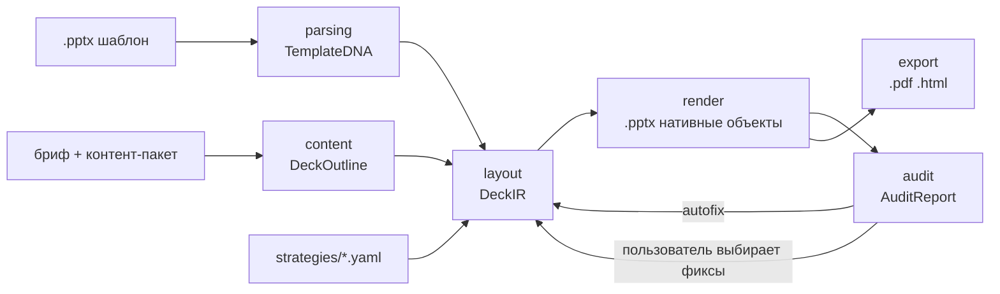

# ARCHITECTURE

## Идея в одном абзаце

Шаблон .pptx читается как **набор правил** (Template DNA): палитра с ролями, типографическая шкала, сетка, фиксированные элементы и **слайды-образцы** с размеченными слотами. Новая презентация собирается **клонированием образцов** и заполнением их слотов контентом, который LLM подготовила заранее (структура → тексты → подгонка под лимиты слотов). Аудит встроен в пайплайн: детерминированные проверки по XML + контекстуальные по PNG, с авто-фиксами и выбором пользователя. Экспорт — нативные объекты .pptx, PDF через LibreOffice, HTML — собственный рендер по XML готовой колоды.

## Пайплайн

## Слои и контракты

| Слой | Вход → Выход | Что знает | Чего не делает |
|---|---|---|---|
| `parsing/` | .pptx → `TemplateDNA` | OOXML (`core/package.py` — пакет, тема, цепочки наследования; общий с `audit/`), LibreOffice-рендер, VLM (`template_tagger`); `dna.build_dna` = токены + сетка/поля (перцентили кромок контентных фигур) + фиксированные элементы + образцы | не знает о брифе и генерации |
| `content/` | бриф + контент-пакет → `DeckOutline`; `DeckOutline` + стратегия → `DeckOutline` с картинками | `content_pack` (папка → фрагменты с id: секции брифа, `*.md`, `data/*.json`, `data/*.csv`), `outline_writer` (один вызов LLM на прогон + `repair_outline`: мягкое приведение ответа к контракту — перенумерация, недоступный архетип → bullets, серии/таблицы/KPI разной формы, обязательные title/closing), `images` (`illustrate`: какие слайды иллюстрировать — по `Strategy.images` и `RunConfig.images`; промпт — скилл `image_prompter` по заголовку, тексту и палитре; генерация — `LLMClient.generate_image`; до 4 картинок на колоду параллельно, кэш по sha1 входов в `<out>/images/`) | не знает координат и шрифтов; стратегию видит только как режим картинок |
| `layout/` | `DeckOutline` + `TemplateDNA` + стратегия → `DeckIR`; `DeckIR` + находки аудита → исправленный `DeckIR` | `planner` (применение стратегии к составу слайдов), `exemplar_picker` (образец под слайд с фолбэками по архетипам), `fitting` (детерминированная подгонка текста под слоты), `autofix` (применение фиксов из каталога `core/autofix` к копии IR, журнал applied/skipped), `slide_filler` (опционально) | не пишет файлы |
| `render/` | `DeckIR` → .pptx | клонирование образцов, python-pptx charts/tables, иконки, картинки | не вызывает LLM |
| `audit/` | .pptx + `TemplateDNA` (+ `DeckIR`, + PNG) → `AuditReport` | `context` (колода читается один раз через `core/deck_reader` — общий с `export/` читатель: фигуры с резолвленными шрифтами/цветами, картинки, данные chart/table; с DeckIR известно, что заполнено нами, что декор образца), 24 детерминированные проверки `deterministic/` (см. `docs/AUDIT.md`), `text_metrics` (Pillow); `contextual/judge` — VLM-судья (`audit_judge`, 11 вопросов по PNG, параллельно по слайдам) | не изменяет колоду (имена фиксов — из `core/autofix.FIXES`, применяет `layout/autofix`) |
| `export/` | .pptx → .pdf / PNG / .html | LibreOffice headless (`render.py`: pptx → pdf → PNG + contact sheet — один путь для VLM-разметки, аудита, превью и PDF); `html.py` — свой рендер готовой колоды в один самодостаточный файл: фон → фигуры мастера → лейаута → слайда (через `core/deck_reader`), текст с резолвленными шрифтами/кеглями/цветами, диаграммы — inline SVG по данным из XML в цветах серий, таблицы — `<table>`, картинки — WebP data-URI (≤ 1920 px, общая часть один раз), встроенные шрифты — `@font-face` по `p:embeddedFontLst` (если EOT без MTX-сжатия; в датасете сжаты → OFL-гарнитуры подключаются с Google Fonts при наличии сети, иначе fallback-стек), `normAutofit` — shrink-to-fit скриптом. Работает с `file://`, режимы «лента» и «показ» (←/→, `?present`), печать по слайду | не вызывает LLM; HTML не из DeckIR — в IR нет декора образца и мастера |
| `pipeline/` | `RunConfig` (yaml) → outline → колоды по стратегиям | этапы как функции: `parse_template` (шаблон → `ParsedTemplate` + `dna.json`), `make_outline` (один вызов LLM или готовый outline), `build_deck` (стратегия: images → layout → render → аудит → safe-автофиксы → re-render → PNG → VLM-судья → PDF → `manifest.json`), `refine_deck` (фиксы по выбору пользователя к готовой колоде), `run` = всё вместе + `compare.md`, `run.json`; `workspace` — реестр шаблонов (датасет + загрузки) и сборка контент-пакета из файлов пользователя | — |
| `api/`, `ui/`, `cli.py` | точки входа | `cli`: `parse` / `run --config` / `audit` / `export` (html/pdf/png для любой колоды); `ui/app.py` (Streamlit) вызывает `pipeline` in-process: шаблон (датасет или загрузка) → бриф + файлы → варианты с PNG → аудит с чекбоксами фиксов (safe / по выбору; replan и дизайн шаблона не чинятся) и подсветкой `Finding.box` на слайде → скачивание .pptx / .pdf / json; `api/app.py` (FastAPI) — те же функции job'ами: `POST /templates`, `POST /generate` → `GET /jobs/{id}` → `.../decks/{strategy}/audit` → `POST .../fix` → `GET .../files/{name}` (белый список имён), `POST /audit` чужой колоды | не содержат бизнес-логики, друг друга не импортируют |

`manifest.json` каждой колоды: шаблон (id, путь, sha1), контент-пакет, путь к outline, стратегия и её версия, версии скиллов (`outline_writer: v1`, `audit_judge: v1`), модели (text / vision / image, base_url), журнал вызовов LLM (длительность, токены — outline и судья по слайдам), план (архетип и заголовок каждого слайда после стратегии), выбранные образцы со скором, предупреждения outline и layout, статистика плотности, сводка аудита (`audit`: ошибки/предупреждения/контекстуальные, по проверкам, слайды с проблемами, путь к `<strategy>.audit.json`; `autofix`: сколько применено/пропущено, `before`/`after` по ошибкам и предупреждениям, журнал правок с «было → стало» или причиной пропуска), картинки (`images`: режим, сколько сгенерировано / из кэша / из контент-пакета / с ошибкой, по слайдам — промпт и путь), экспорты (`exports`: `pptx`, `pdf`, `html`), тайминги (`parse`, `outline`, `images`, `layout`, `render`, `audit`, `autofix`, `png`, `audit_contextual`, `export_pdf`, `export_html`, `refine`). После `refine_deck` — `audit.autofix.user_applied`, журнал дополняется, `audit.contextual_stale: true`, если находки судьи относятся к колоде до фиксов. `<strategy>.ir.json` — IR уже после фиксов. Рядом — `dna.json` (полная `TemplateDNA` прогона). Сводка прогона — `run.json` (+ `compare.md`); ключ `not_implemented` теперь пуст — все шаги конфига выполняются.

Контракты (`deckforge/core/ir.py`): `TemplateDNA`, `DeckOutline`, `DeckIR`, `AuditReport` — pydantic v2, сериализуются в JSON и лежат рядом с выходной колодой для воспроизводимости.

## Ключевые решения и почему

1. **Токены из фактического использования, не из темы.** В датасете `theme.xml` у одного шаблона содержит дефолтные Office-цвета и Arial, тогда как слайды используют `#0077FF` и встроенный шрифт Play. Экстрактор строит гистограммы по слайдам/лейаутам/мастеру, резолвит `schemeClr` через тему, тема — только fallback.
2. **Клонирование образцов, а не генерация по лейаутам.** У VK WorkSpace все 15 лейаутов содержат единственный плейсхолдер `title`; весь дизайн живёт в свободных фигурах слайдов. Единственный способ воспроизвести стиль — копировать XML слайда-образца (с rels и медиа) и подменять содержимое слотов. Побочный эффект: экспорт .pptx нативными объектами получается автоматически.
   Механика (`render/pptx_writer.py`): выходной файл — сам шаблон, открытый python-pptx; исходные слайды отвязываются от `p:sldIdLst` перед сохранением (мастера, лейауты, тема и встроенные шрифты остаются), для каждого слайда колоды копируется `p:cSld` + `p:clrMapOvr` образца, связи переносятся с переписыванием rId (картинки — общие части, chart/diagram/xlsx — глубокая копия, т.к. один образец может клонироваться несколько раз). Текст заполняется новыми абзацами с `pPr`/`rPr` образца по уровню, картинки — подменой `blip` с center-crop, chart/table — нативными объектами python-pptx на месте фигур образца. Незаполненное убирается, а не остаётся заглушкой: текстовые слоты очищаются, слот с собственной рамкой и «контейнер» (фон карточки/строки без единого заполненного слота) удаляются вместе со своим декором, заглушки вроде «Вставить фото» чистятся даже у фиксированных фигур (`core/placeholders`). Ничего не растеризуется.
   Особенность LibreOffice (им делаются PDF, PNG и, значит, картинки для судьи): плейсхолдеры *лейаута* без пары на слайде он рисует — с текстом-подсказкой «Образец текста» и заливкой карточек; PowerPoint их не показывает. Писатель переносит наследуемые xfrm/заливку/обводку в плейсхолдеры слайда и гасит контентные плейсхолдеры лейаутов (поля — номер, дата — не трогает): вид в PowerPoint не меняется, PDF/PNG чистые.
3. **Архетипы по геометрии.** Имена лейаутов ненадёжны (`14_Контент`, `DEFAULT`, дубликаты). Классификация: детерминированные правила по плейсхолдерам/bbox/типам фигур, VLM уточняет неоднозначные случаи и размечает декор. Ответы VLM кэшируются (`out/archetypes/<stem>.json`, привязка к sha1 файла) и при загрузке накладываются на свежий профиль правил — слоты не хранятся, поэтому правки правил (вместимость заголовка по плашке под ним, тела карточки — по высоте подложки, chart-слот на крошечной цифре в центре нарисованного кольца растягивается на декор) действуют сразу.
4. **Стратегии как файлы.** Три варианта вёрстки (`executive`, `narrative`, `visual`) отличаются плотностью, приоритетом архетипов и способом визуализации данных. Ось различий — *плотность + визуализация*, потому что именно она видна с первого взгляда и одинаково применима к любому шаблону. Подробно — в разделе «Три стратегии: ось различий».
5. **Скиллы версионируются как данные.** `skills/<name>/v<N>/` + `registry.yaml`; в `manifest.json` каждой колоды — версии скиллов, моделей и стратегии. Промптов в коде нет.
6. **Аудит с авто-фиксом внутри цикла.** Детерминированные проверки дешёвые (< 1 с на колоду, измерено) — выполняются после каждого рендера; контекстуальные (VLM) — один раз в конце, параллельно по слайдам (15 слайдов ≈ 33 с, измерено), чтобы уложиться в 5 минут. Аудит различает «мы сломали» и «так устроен шаблон»: геометрия и цвета, унаследованные от образца, дают `warning` с `evidence.in_exemplar`, наши — `error`; проверки шаблонности смотрят только на заполненные нами слоты и добавленные объекты. Без `DeckIR` аудит работает на любой чужой колоде.
   Фиксы делятся на три класса (`core/autofix.FIXES`): *safe* — правка IR без потери смысла (уменьшить кегль, привести к шкале, укоротить пункт, подписи диаграммы) — применяются в `run` автоматически, после чего колода рендерится заново и аудит повторяется (`before`/`after` в manifest); *ir* — теряют контент (удалить слайд-дубликат, лишние серии) — только по выбору пользователя; *replan* — нужен другой образец или пересбор состава — остаются предложением. Дизайн шаблона (`in_exemplar`) не чинится никогда: если в образце подпись KPI стоит под цифрой, это не дефект. Аудит колоду не меняет — применяет фиксы `layout/`, поэтому CLI-`audit` на чужой колоде только показывает, что *чинилось бы* (`--fix-plan`).

## Три стратегии: ось различий

**Почему плотность и визуализация, а не цвет, шрифт или сетка.** Стиль задаёт шаблон, и ТЗ требует его соблюдать — значит, варианты не могут различаться палитрой, гарнитурой или композицией слайдов: всё это берётся из образцов. Остаётся то, чем реально различаются презентации одного автора для разных случаев: *сколько* сказать на слайде и *в какой форме* показать числа. Эта ось (а) видна на контактном листе без чтения текста, (б) переносится на любой шаблон, потому что оперирует архетипами, а не координатами, и (в) полностью описывается пятью параметрами в YAML — версионируемыми и проверяемыми.

Стратегия — `strategies/<name>.yaml`, схема `core/strategy.py` (`Strategy`, pydantic). Параметры v1:

| | executive | narrative | visual |
|---|---|---|---|
| целевой объём | 8–10 | 12–15 | 10–12 |
| буллетов / слов в буллете | 6 / 12 | 4 / 10 | 6 / 8 |
| макс. заполнение слайда | 0,75 | 0,55 | 0,70 |
| числовой ряд → | **таблица** | диаграмма | диаграмма |
| сравнение (таблица) → | таблица | две колонки | **диаграмма** |
| ключевые метрики → | KPI (или карточки, если не влезают) | **KPI, по слайду** | KPI |
| разделители разделов | нет | **да** | нет |
| приоритет архетипов | kpi, table, cards, bullets… | section, kpi, quote, bullets… | chart, process, cards, image_text… |
| картинки / иконки | только из контента | генерируются для image_text/image_full и где просит outline | генерируются и для текстовых слайдов, титула, финала (до 4 на колоду) / иконки |

**Где стратегия действует в пайплайне.** Контент (`DeckOutline`) один и тот же: outline генерируется один раз на прогон (один вызов LLM), `outline_writer` стратегию не видит — целевой объём и правила плотности ему не передаются. Стратегия применяется в двух местах и нигде больше.

1. `layout/planner.py` — состав слайдов, четыре шага в фиксированном порядке: *визуализация данных* (chart ↔ table ↔ kpi по `data_visualization`; таблица становится диаграммой только если её колонки числовые, колонки-«дельты» отбрасываются) → *плотность* (слайд с буллетами сверх лимита делится на части «(1/2)», буллеты укорачиваются по смысловым разделителям; KPI-слайд делится по вместимости лучшего KPI-образца шаблона, пока есть запас по объёму, части получают «(1/2)») → *разделы* (слайды-разделители ставятся перед первым слайдом каждого `section`, если в шаблоне есть такой образец) → *объём* (лишние разделители снимаются у самых коротких разделов, соседние слайды сливаются в карточки — сначала пары текстовых (буллеты, шаги становятся нумерованными пунктами), и только если таких нет — KPI («значение — подпись») и цитата; при недоборе — разбиение). Планировщик не выдумывает текст: все слова и числа — из outline, теряться может только хвост буллета после тире/запятой (пункт до 3 слов сверх лимита не режется вовсе).
   Иллюстрации (`content/images`) генерируются *до* планировщика: picker видит `image.path` и предпочитает образец с одной рамкой под картинку, штрафуя образцы с несколькими (в них останутся фото шаблона); слитый слайд картинку сохраняет.
2. `layout/exemplar_picker.py` — образец под слайд. Для «гибких» текстовых архетипов (bullets / cards / two_column / image_text) порядок кандидатов задаёт `archetype_priority` стратегии; структурные и data-архетипы planner уже выбрал. Цепочки фолбэков (`FALLBACKS`) делают колоду собираемой на шаблоне, где нужного архетипа нет: у VK WorkSpace нет section и bullets, у ЛЦТ2026 — kpi, table и closing; ни один слайд не пропускается. Скор образца учитывает вместимость слотов (нехватка дороже пустых слотов — иначе контент уедет на слайд-продолжение), плотность (`max_fill_ratio`), картинки (без картинки в контенте picture-образец штрафуется — иначе останется заглушка шаблона), иконки, качество разметки (нет слота под заголовок, заголовок заходит под контент, нерегулярная сетка карточек) и повторное использование.

Подгонка текста (`layout/fitting.py`) от стратегии не зависит: хвост по разделителям → обрезка по словам → кегль до 70 % от кегля образца (крупные цифры KPI — до 40 %, единица измерения мелким кеглем рядом).

**Что получилось на одном контенте** (`examples/output/vk_tech/outline.json` — outline, написанный LLM по брифу «Пульс команды»: 12 слайдов — титул, 6 причин проблемы, 3 KPI, 5 шагов, 4 выгоды, ряд по месяцам, таблица 4×4, цитата, 3 KPI результата, 3 риска, 3 этапа плана, финал; шаблон VK Tech; финальный прогон дня 11 с судьёй и картинками, `examples/output/vk_tech/compare.md`):

| стратегия | слайдов | архетипы по порядку | пунктов/слайд | слов/пункт | chart | table | KPI-слайдов | аудит err/warn |
|---|---|---|---|---|---|---|---|---|
| executive | 10 | title → cards → kpi → process → cards → table → table → cards → cards → closing | 8,8 | 4,0 | 0 | 2 | 1 | 0/36 |
| narrative | 15 | title → section → cards → cards → kpi → process → cards → chart → table → section* → section → kpi → cards → process → closing | 5,2 | 4,5 | 1 | 1 | 2 | 3/27 |
| visual | 12 | title → cards → kpi → process → cards → chart → chart → image_text → kpi → cards → process → closing | 5,8 | 3,9 | 2 | 0 | 2 | 3/31 |

\* `section` здесь — образец-разделитель, в который уложена цитата (в VK Tech нет архетипа quote; крупный заголовок + подпись автора — ближайшая форма). Ошибки аудита (err) — оставшиеся после safe-фиксов, в основном L03 «заголовок в две строки» на однострочных боксах образцов; сводка по всем 12 колодам — в `examples/output/*/compare.md`.

Что видно на контактных листах (`examples/output/vk_tech/<strategy>/contact.png`, рендер — `deckforge export … --png`):

- **executive** — самая короткая и самая плотная колода: 8,8 пунктов на слайд. Шесть причин проблемы — одна сетка карточек, три KPI пилота — слайд с кольцами, ряд по месяцам и сравнение «до/после» — две таблицы, цитата с KPI результата и риски с планом слиты в два слайда карточек. Ни одного разделителя и ни одной диаграммы.
- **narrative** — самая длинная и самая разреженная: 5,2 пункта на слайд, 15 слайдов, три из них — разделители разделов (в один уложена цитата). Те же шесть причин разложены на два слайда «(1/2)» и «(2/2)», KPI — два слайда с крупными цифрами в кольцах, ряд по месяцам — линейная диаграмма. Один слайд — одна мысль.
- **visual** — две диаграммы вместо одной: числовой ряд и таблица «до/после» стали диаграммами; цитата — на image_text-образце со сгенерированной иллюстрацией; текст — только карточками (в приоритете образцы с иконками), тезисы короче всех (3,9 слова). Объём средний.

Различия воспроизводимы и объяснимы: в `manifest.json` каждой колоды — план (архетип и заголовок каждого слайда после стратегии), выбранный образец и его скор, предупреждения планировщика. Один и тот же outline на VK Education, VK WorkSpace и holdout-шаблоне ЛЦТ2026 даёт те же три профиля с поправкой на состав образцов (у ЛЦТ2026 нет table-образца — нативная таблица executive встаёт на место диаграммы chart-образца; у WorkSpace narrative остаётся без разделителей — их в шаблоне нет; `examples/output/<template>/`).

Известные ограничения v1 (закрываются аудитом и следующими итерациями, список — `docs/BACKLOG.md`): вместимость слотов оценивается по геометрии, а не по метрикам шрифта, поэтому двухстрочные заголовки допускаются «на глаз» и дают L03 на однострочных боксах; образец с несколькими рамками под картинки при одной иллюстрации оставляет фото шаблона в остальных; единственный `bullets`-образец VK Tech — слайд с кодом на тёмном фоне, и стратегия narrative честно его выбирает, когда карточки штрафуются за плотность.

## Бюджет времени на колоду (цель ≤ 5 мин)

| Шаг | Вызовов LLM | Оценка |
|---|---|---|
| parsing (кэшируется по hash шаблона) | ≤ N образцов VLM, параллельно | 30–60 с, один раз |
| outline | 1 | 30–45 с (Qwen3.8-27B через OpenRouter, ~1900 токенов ответа) |
| images (visual / narrative) | ≤ 4 промпта + ≤ 4 генерации, параллельно ×4 | ≈ 13 с на колоду (измерено: `timings_s.images`), повтор — из кэша |
| slide_filler | по слайду, параллельно ×4 | 20–40 с (пока не подключён) |
| layout + render (три колоды) | 0 | 1–3 с на колоду (измерено: `timings_s` в manifest) |
| deterministic audit + safe-autofix + re-render | 0 | < 2 с на колоду (измерено: `timings_s.audit`, `autofix` в manifest) |
| contextual audit | по слайду, параллельно ×4 | 33–150 с на 12–15 слайдов, ≈22k токенов (измерено: `timings_s.audit_contextual`; разброс — латентность OpenRouter) |
| export pdf | 0 (LibreOffice) | 4–5 с на колоду; ≈0 с, если PNG уже рендерились (PDF из той же конвертации) — измерено |
| export html | 0 | 1–3 с на колоду (больше всего — пережатие 4K-подложек шаблона в WebP); 0,2–2,2 МБ на файл — измерено на 12 колодах |

## Обозначения

- Координаты в IR — EMU (OOXML). Конвертеры — `core/units.py`.
- `exemplar.id` = `slide<N>` исходного файла; `slot.id` = id фигуры в XML (`p:cNvPr/@id`).
