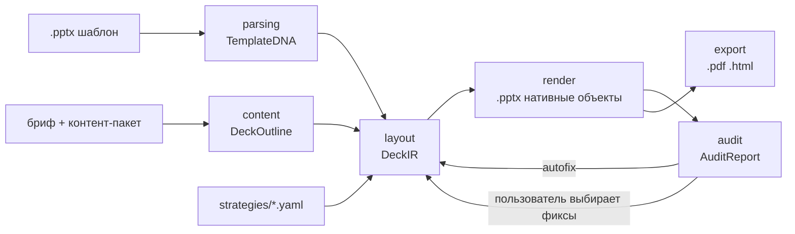

# ARCHITECTURE

## Идея в одном абзаце

Шаблон .pptx читается как **набор правил** (Template DNA): палитра с ролями, типографическая шкала, сетка, фиксированные элементы и **слайды-образцы** с размеченными слотами. Новая презентация собирается **клонированием образцов** и заполнением их слотов контентом, который LLM подготовила заранее (структура → тексты → подгонка под лимиты слотов). Аудит встроен в пайплайн: детерминированные проверки по XML + контекстуальные по PNG, с авто-фиксами и выбором пользователя. Экспорт — нативные объекты .pptx, PDF через LibreOffice, HTML из той же IR.

## Пайплайн

## Слои и контракты

| Слой | Вход → Выход | Что знает | Чего не делает |
|---|---|---|---|
| `parsing/` | .pptx → `TemplateDNA` | OOXML, LibreOffice-рендер, VLM (`template_tagger`) | не знает о брифе и генерации |
| `content/` | бриф + контент-пакет + стратегия → `DeckOutline` | LLM (`outline_writer`), список доступных архетипов | не знает координат и шрифтов |
| `layout/` | `DeckOutline` + `TemplateDNA` + стратегия → `DeckIR` | подбор образца под слайд, вместимость слотов, `slide_filler` | не пишет файлы |
| `render/` | `DeckIR` → .pptx | клонирование образцов, python-pptx charts/tables, иконки, картинки | не вызывает LLM |
| `audit/` | .pptx + `DeckIR` (+ PNG) → `AuditReport` | XML-геометрия, палитра, шрифты; VLM (`audit_judge`) | не изменяет колоду (фиксы применяет `layout/`) |
| `export/` | .pptx / `DeckIR` → .pdf / .html | LibreOffice headless; свой HTML-рендер | — |
| `pipeline/` | оркестрация, тайминги, `manifest.json` | всё выше | — |
| `api/`, `ui/`, `cli.py` | точки входа | `pipeline` | не содержат бизнес-логики |

Контракты (`deckforge/core/ir.py`): `TemplateDNA`, `DeckOutline`, `DeckIR`, `AuditReport` — pydantic v2, сериализуются в JSON и лежат рядом с выходной колодой для воспроизводимости.

## Ключевые решения и почему

1. **Токены из фактического использования, не из темы.** В датасете `theme.xml` у одного шаблона содержит дефолтные Office-цвета и Arial, тогда как слайды используют `#0077FF` и встроенный шрифт Play. Экстрактор строит гистограммы по слайдам/лейаутам/мастеру, резолвит `schemeClr` через тему, тема — только fallback.
2. **Клонирование образцов, а не генерация по лейаутам.** У VK WorkSpace все 15 лейаутов содержат единственный плейсхолдер `title`; весь дизайн живёт в свободных фигурах слайдов. Единственный способ воспроизвести стиль — копировать XML слайда-образца (с rels и медиа) и подменять содержимое слотов. Побочный эффект: экспорт .pptx нативными объектами получается автоматически.
3. **Архетипы по геометрии.** Имена лейаутов ненадёжны (`14_Контент`, `DEFAULT`, дубликаты). Классификация: детерминированные правила по плейсхолдерам/bbox/типам фигур, VLM уточняет неоднозначные случаи и размечает декор.
4. **Стратегии как файлы.** Три варианта вёрстки (`executive`, `narrative`, `visual`) отличаются плотностью, приоритетом архетипов и способом визуализации данных. Ось различий — *плотность + визуализация*, потому что именно она видна жюри с первого взгляда и одинаково применима к любому шаблону.
5. **Скиллы версионируются как данные.** `skills/<name>/v<N>/` + `registry.yaml`; в `manifest.json` каждой колоды — версии скиллов, моделей и стратегии. Промптов в коде нет.
6. **Аудит с авто-фиксом внутри цикла.** Детерминированные проверки дешёвые — выполняются после каждого рендера; контекстуальные (VLM) — один раз в конце, параллельно по слайдам, чтобы уложиться в 5 минут.

## Бюджет времени на колоду (цель ≤ 5 мин)

| Шаг | Вызовов LLM | Оценка |
|---|---|---|
| parsing (кэшируется по hash шаблона) | ≤ N образцов VLM, параллельно | 30–60 с, один раз |
| outline | 1 | 10–20 с |
| slide_filler | по слайду, параллельно ×4 | 20–40 с |
| render + deterministic audit | 0 | 5–10 с |
| contextual audit | по слайду, параллельно ×4 | 30–60 с |
| export pdf | 0 (LibreOffice) | 10–20 с |

## Обозначения

- Координаты в IR — EMU (OOXML). Конвертеры — `core/units.py`.
- `exemplar.id` = `slide<N>` исходного файла; `slot.id` = id фигуры в XML (`p:cNvPr/@id`).
